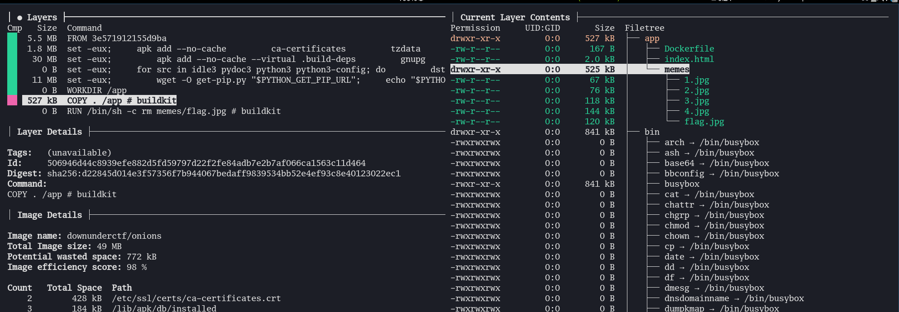
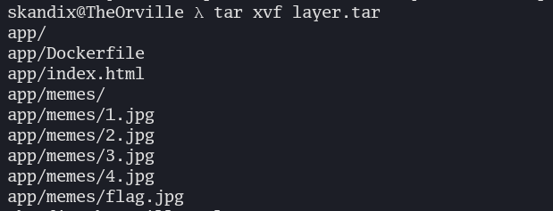
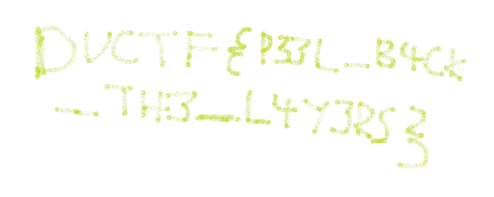

#  ogres are like onions 


## Chall Description
if you see this you have to post in #memes thems the rules

``docker run -tp 8000:8000 downunderctf/onions``

[hint](https://youtu.be/uFRHP02PruE)

Author: emily


## Solution

Since the task is about finding something inside a docker image, we can start by finding the Docker hub [link](https://hub.docker.com/layers/downunderctf/onions/latest/images/sha256-d73621b46fe83e5d835f05c6e718e155c9fdac7b5483b367bb556654f5002883?context=explore) for the image.
By looking here we can see that inside the layer 18 that they are deleting the flag we want... 😭

We can use a tool called [Dive](https://github.com/wagoodman/dive) to closely inspect the layers of the docker image.

We can start inspecting the docker image with dive, with this command. ``dive downunderctf/onions``

In this screenshot, we can see that we have all the files we want, and can note down the layer id ``506946d4 ``



So to get out the ``flag.jpg`` there are many ways to extract this, but i find this the easiest.
I use the [**docker save**](https://docs.docker.com/engine/reference/commandline/save/) command to save the image to a tar archive.
```bash
docker save downunderctf/onions -o onion.tar
```

After saving it, I can uncompress the tar file, and cd to the correct folder, where as here the foldername is the layer id. Then un-compress the tar file which holds the files for the layer itself.

```bash
tar xvf onion.tar
cd 506946d44c8939efe882d5fd59797d22f2fe84adb7e2b7af066ca1563c11d464
tar xvf layer.tar
```
Here we can see the files inside layer.tar.


and.. we got the flag by opening flag.jpg.

<br>
<br>
<br>

---

**FLAG:** ``DUCTF{P33L_B4CK_TH3_L4Y3RS}``
