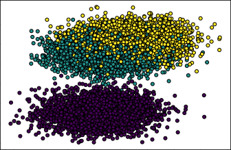

# Misc / Classification

> **Author:** `sweeet`  
> <br/> 
> **Description:** Predict the correct classes and be rewarded. Achieve 85% or above to recieve the flag. You can use the code to get the data from the .npy file. Provide the classification in the same order you predict it Example: 12010121010110...102220010101010. Good luck!  
>
> `nc io.ept.gg 30044`

To begin with we were provided a datafile ( `data.npy` ) and some example code:

```python
import numpy as np 
from matplotlib import pyplot as plt


with open("data.npy", "rb") as f: 
    # Data to train on
    x_train = np.load(f)
    # Predict the correct class 
    x_test = np.load(f)
    # Training data (correct class)
    y_train = np.load(f)


# Example code to print the training data
plt.scatter(x_train[:, 0], x_train[:, 1], marker="o", c=y_train, s=25, edgecolor="k")
plt.show()
```

Looking at the example code it seems everything we need to solve this has already been given to us without the need for any manipulation of the data.  
  
Looking at the scatterplot from the example code, the data seems to be grouped in two very nice clusters and should be plenty enough to train a classifier.



So - let's try training a Support Vector Machine and see if it can learn some stuff for us!

Why not borrow some more example code, but this time from [scikit learn](https://scikit-learn.org/stable/modules/generated/sklearn.svm.SVC.html):

```python
from sklearn.pipeline import make_pipeline
from sklearn.preprocessing import StandardScaler
from sklearn.svm import SVC
clf = make_pipeline(StandardScaler(), SVC(gamma='auto'))
clf.fit(x_train, y_train)
```

After training we can check the accuracy on the training data:
```python
from sklearn.metrics import accuracy_score
predicted = clf.predict(x_train)
print(accuracy_score(y_train, predicted))
```
```
$ 0.8406140350877193
```
Ooops... That won't do. The challenge text said we would need at least 85% accuracy, but we're shy ~1% on the training data 😔  
  
However - why not try our luck and see if it's good enough?
```python
res = clf.predict(x_test)
print("".join(str(x) for x in res))
```
```
100202001011110121220212210200202021220012122110001102222102220102220101221120111112211211201221020210022112100112011010110122011011010211220012021221100010200121121211012012221201210120000020220220002211220022222020201122000022222121121112121212120020121011102110021202020222220012002010220112012002211102220000002020100222011022111121102020212001210202120212111020002110012210001101222011212010100200021202022111121212011101011211121002120102001120010121010210200211001100200220112020121220210002122200220122220022200100220010110102200211022212120202201102001111122211102010101122000201020002200211
```

Now - connect to the challenge endpoint and copy/paste straight into the terminal...

...and 🥁

We got it!

```
Here is your flag:  EPT{th1s_w4s_4n_34sy_ch4ll_w4snt_1t}
```

Apparently the classifier was good enough to predict the test data and get an accuracy over 85% 😊
