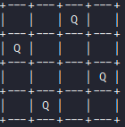

# Misc/queens
> **Author:** `sweeet` 
> <br/>
> **Description** Welcome to the Queens challenge. 
> 
> The rules are simple: Provide a valid board with the number of queens given in such a way that no queen can attack each other. Format: W,X...,Y,Z (no space between numbers and commas) 
> 
> For clarification: A possible board with four queens is 3,1,4,2 which means on the first row there is a queen in the third column, on the second row there is a queen in the first column etc. See the below board for reference:
>
>
>
> `nc io.ept.gg 30041`

When connecting to the server you are presented with a 5x5 chess board with one randomly predefined queen. Solving this board is easy if you understand how a queen attacks in chess (or if your proficient at googling). After solving the board you're presented with another board, this time a 7x7 board with two predefined queens. After seeing the second board it became apparent that the challenge would present larger boards, thus requiring a script to efficiently solve. 

Being a python newbie my first attempt used a Google OR-Tools package to create the solver, and some example code on how to solve the n-Queens problem on their [website](https://developers.google.com/optimization/cp/queens).
```python
"""OR-Tools solution to the N-queens problem."""
import sys
from ortools.constraint_solver import pywrapcp


def main(board_size):
    # Creates the solver.
    solver = pywrapcp.Solver('n-queens')

    # Creates the variables.
    # The array index is the column, and the value is the row.
    queens = [solver.IntVar(0, board_size - 1, f'x{i}') for i in range(board_size)]

    # Creates the constraints.
    # All rows must be different.
    solver.Add(solver.AllDifferent(queens))

    # All columns must be different because the indices of queens are all different.
    # No two queens can be on the same diagonal.
    solver.Add(solver.AllDifferent([queens[i] + i for i in range(board_size)]))
    solver.Add(solver.AllDifferent([queens[i] - i for i in range(board_size)]))

    db = solver.Phase(queens, solver.CHOOSE_FIRST_UNBOUND,
                      solver.ASSIGN_MIN_VALUE)

    # Iterates through the solutions, displaying each.
    num_solutions = 0
    solver.NewSearch(db)
    while solver.NextSolution():
        # Displays the solution just computed.
        for i in range(board_size):
            for j in range(board_size):
                if queens[j].Value() == i:
                    # There is a queen in column j, row i.
                    print("Q", end=" ")
                else:
                    print("_", end=" ")
            print()
        print()
        num_solutions += 1
    solver.EndSearch()

    # Statistics.
    print('\nStatistics')
    print(f'  failures: {solver.Failures()}')
    print(f'  branches: {solver.Branches()}')
    print(f'  wall time: {solver.WallTime()} ms')
    print(f'  Solutions found: {num_solutions}')


if __name__ == '__main__':
    # By default, solve the 8x8 problem.
    board_size = 8
    main(board_size)
```
I appended the example code with a couple of nested loops to cross check the list of solutions with an array of predefined queens that i could modify, and thereafter print a solution that matched the syntax that the challenge requests. You can find the complete OR-tools script [here](badsolver.py).

```python
        for a in range(board_size):
            for b in range(board_size):
                if array1[b][a] == 1:
                    if array2[b][a] != 1:
                        checker = 1
        if checker == 0:
            for i in range(board_size):
                increment = 1
                for j in range(board_size):
                    if array2[i][j] == 1:
                        print(increment, end=',')
                    increment += 1
            sys.exit()
        checker = 0
```
The script i had modified solved the 5x5, 7x7, 10x10 and 13x13 boards easily. However the last board (18x18) wouldn't solve. This was simply due to the fact that the script would first provide all the solutions for the 18 queen problem and thereafter check if any of [millions](https://en.wikipedia.org/wiki/Eight_queens_puzzle#Counting_solutions) of solutions matched the predefined array.

After playing around with the code for a while i decided to scrap the OR-tools library and try to write the checks and functions myself. Again being a python newbie (*can't stress this enough*) i modified some example code (with python2 print functions lol) found on [geeksforgeeks](https://www.geeksforgeeks.org/python-program-for-n-queen-problem-backtracking-3/).

This code was trickier to modify since it wasn't using a simpler "black box solver" like the one found in the OR-tools package. However it would only generate one solution in its current state therefore making it probably able to solve the 18 queens boards.

My first idea was to modify the `isSafe` function to check after each queen is placed if the placed queen could attack one of the predefined queens. Writing the code for this proved to be difficult so i tried a different approach.

My second idea was leaving the `isSafe` function as is and instead FORCING the `solveNQUtil` function to place queens in positions it got from the array `predefinedQueens`. I did this by writing the code below into the start of the `solveNQUtil` function and creating a new array to add the predefined queens to.
```python
if predefined[col] is not None:
        if not isSafe(board, predefined[col], col):
            return False

        board[predefined[col]][col] = 1

        if solveNQUtil(board, col + 1, predefined):
            return True

        board[predefined[col]][col] = 0
```
The script spat out a solution to the 5x5 board i was testing. Now - to test if the script could handle the 18 queen boards. I connected to the server and solved my way up to the 18 queens board again. Here's the full code i ran with the corresponding queens added into the `predefinedQueens` array.
```python
import numpy as np

N = 18


def printSolution(board):
    np.set_printoptions(threshold=np.inf)
    print(board)
    #  prints the syntax that the challenge accepts
    for i in range(N):
        increment = 1
        for j in range(N):
            if board[i][j] == 1:
                print(increment, end=',')
            increment += 1


def isSafe(board, row, col):
    for i in range(col):  # Check this row on left side
        if board[row][i] == 1:
            return False

    for i, j in zip(range(row, -1, -1),  # Check upper diagonal on left side
                    range(col, -1, -1)):
        if board[i][j] == 1:
            return False

    for i, j in zip(range(row, N, 1),  # Check lower diagonal on left side
                    range(col, -1, -1)):
        if board[i][j] == 1:
            return False

    return True


def solveNQUtil(board, col, predefined):
    if col >= N:  # If all queens are placed then return true
        return True

    if predefined[col] is not None:
        if not isSafe(board, predefined[col], col):
            return False

        board[predefined[col]][col] = 1

        if solveNQUtil(board, col + 1, predefined):
            return True

        board[predefined[col]][col] = 0
    else:
        for i in range(N):

            if isSafe(board, i, col):

                board[i][col] = 1  # Place this queen in board[i][col]

                if solveNQUtil(board, col + 1, predefined):  # recur to place rest of the queens
                    return True

                board[i][col] = 0  # backtracking

    return False


# Predefined Queens in Columns x
predefinedQueens = [None, 2, None, None, None, 15, None, 11, 16, 7, 17, None, 1, 10, None, None, None, 13]


def solveNQ():
    board = np.zeros((N, N))

    if not solveNQUtil(board, 0, predefinedQueens):
        print("Solution does not exist")
        return False

    printSolution(board)
    return True


solveNQ()
```
Running the script returns the full solved array and the syntax that the challenge accepts:
```
[[1. 0. 0. 0. 0. 0. 0. 0. 0. 0. 0. 0. 0. 0. 0. 0. 0. 0.]
 [0. 0. 0. 0. 0. 0. 1. 0. 0. 0. 0. 0. 0. 0. 0. 0. 0. 0.]
 [0. 1. 0. 0. 0. 0. 0. 0. 0. 0. 0. 0. 0. 0. 0. 0. 0. 0.]
 [0. 0. 0. 0. 0. 0. 0. 0. 0. 0. 0. 0. 0. 0. 0. 0. 1. 0.]
 [0. 0. 1. 0. 0. 0. 0. 0. 0. 0. 0. 0. 0. 0. 0. 0. 0. 0.]
 [0. 0. 0. 0. 0. 0. 0. 0. 0. 1. 0. 0. 0. 0. 0. 0. 0. 0.]
 [0. 0. 0. 0. 0. 0. 0. 0. 0. 0. 0. 0. 0. 0. 1. 0. 0. 0.]
 [0. 0. 0. 0. 0. 0. 0. 0. 0. 0. 1. 0. 0. 0. 0. 0. 0. 0.]
 [0. 0. 0. 0. 0. 1. 0. 0. 0. 0. 0. 0. 0. 0. 0. 0. 0. 0.]
 [0. 0. 0. 0. 0. 0. 0. 0. 0. 0. 0. 0. 0. 0. 0. 1. 0. 0.]
 [0. 0. 0. 0. 0. 0. 0. 0. 0. 0. 0. 0. 0. 0. 0. 0. 0. 1.]
 [0. 0. 0. 0. 1. 0. 0. 0. 0. 0. 0. 0. 0. 0. 0. 0. 0. 0.]
 [0. 0. 0. 0. 0. 0. 0. 0. 0. 0. 0. 0. 0. 1. 0. 0. 0. 0.]
 [0. 0. 0. 1. 0. 0. 0. 0. 0. 0. 0. 0. 0. 0. 0. 0. 0. 0.]
 [0. 0. 0. 0. 0. 0. 0. 0. 1. 0. 0. 0. 0. 0. 0. 0. 0. 0.]
 [0. 0. 0. 0. 0. 0. 0. 0. 0. 0. 0. 1. 0. 0. 0. 0. 0. 0.]
 [0. 0. 0. 0. 0. 0. 0. 1. 0. 0. 0. 0. 0. 0. 0. 0. 0. 0.]
 [0. 0. 0. 0. 0. 0. 0. 0. 0. 0. 0. 0. 1. 0. 0. 0. 0. 0.]]
1,7,2,17,3,10,15,11,6,16,18,5,14,4,9,12,8,13,
```
Pasting the last string of numbers (excluding the last comma) into the terminal solves the challenge and grants us the flag:

```
EPT{th3_qu33ns_st00d_z3r0_ch4nc3}
```